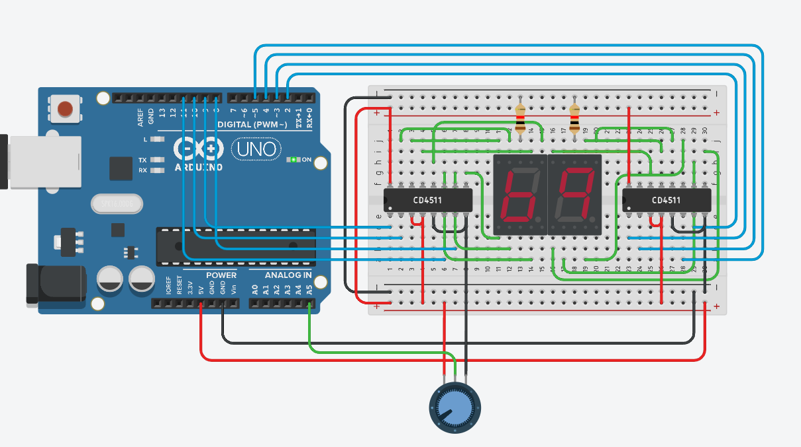

# R3-SoftwareTask1-RazeenFaruque

For this task I programed two 7-segment displays to display a number between 0 and 99 based on a potentiometers position.  
  

The way it works is that the potentiometers output is being read and then mapped to a smaller range of 0-99 from its regular 0-1023 range then I took the double digit number outputted by the potentiometer and split it into its seperate digits ex. 12 --> 1 and 2 from there I used a simple switch statement to display the first digit on the first sseg display and did then repeated for the other number. 

[TinkerCAD](https://www.tinkercad.com/things/fR7qw6Eqs56-r3-softwaretask1-razeenfaruque)